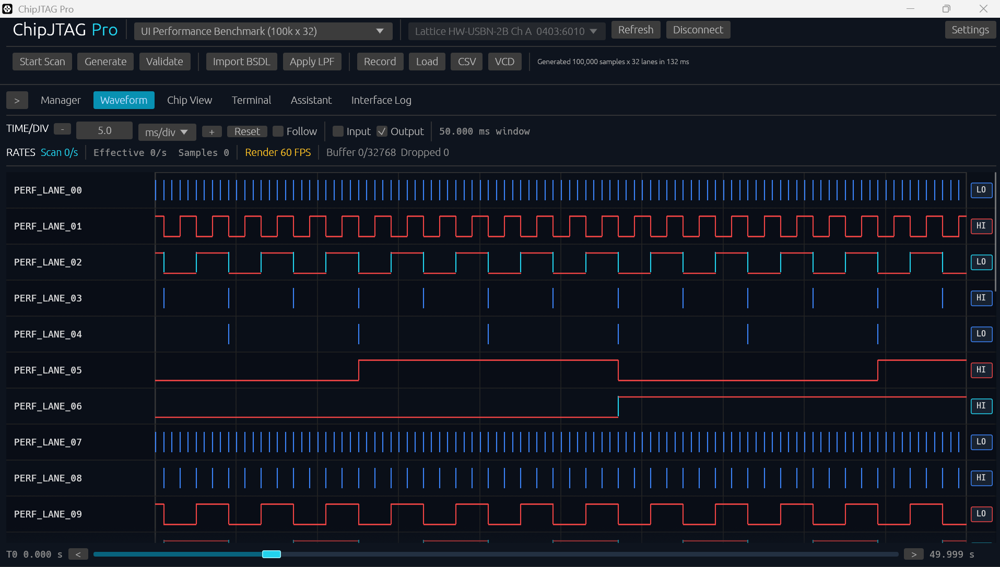

# 波形操作說明

## 介面示意

此圖使用合成的 `PERF_LANE_*` 資料展示原生波形檢視介面。它可用來確認
lane 排列、波形繪製及水平檢視方式。圖中的 adapter selector 只是當時的 UI
狀態，沒有執行硬體 JTAG I/O；`0.000 s` 到 `49.999 s` 是完整合成資料範圍，
`50.000 ms window` 是目前 viewport。此圖不能當成實體 adapter、板卡 sample
rate、direction filter 或 timing accuracy 的驗證證據。

## Timing 證據

`Render FPS`、`Scan/s` 與硬體 sample interval 是不同數值。只有具備硬體 timestamp、
單調遞增且不重複的 timestamp、足夠 sample 數及 interval 檢查，才可作為
timing evidence。純軟體產生 waveform 即使顯示 0.5 ms 間隔，也不能證明
實體硬體達到 1 ms。

## 顯示規則

- Input：藍色。
- Output：紅色。
- Bidirectional（Bidir）：可同時顯示 input/output，並可分別關閉。
- Z：紅色虛線。
- 尚未量測到資料：空白，不預填 Low。

## Time/Div

Time/Div 是示波器式的顯示刻度，不會修改已儲存的原始 timestamp。

- 可直接輸入數字。
- 單位可在 `us/div`、`ms/div`、`s/div` 等刻度切換。
- `+` / `-` 或滑鼠滾輪可放大及縮小時間範圍。
- 水平捲動只改變 viewport，不應改變固定的 `T0 = 0` 或 waveform timestamp。
- `Follow` 開啟時，viewport 跟隨最新資料。

若只想上下捲動更多 pin，請在 lane/pin 區域使用垂直捲動；避免在 waveform
繪圖區誤觸 Time/Div zoom。

## 游標

Waveform 提供 A、B、C 游標：

- 每個游標顯示相對 `T0` 的時間。
- 游標間可顯示時間差（time period）。
- 清除游標不會刪除 waveform。

## Scan History

每次執行 `Start Scan` 都應建立獨立 history segment：

- 保留先前 scan，不自動清除。
- 每段顯示日期與時間。
- 不同 scan 之間保留 gap，避免將兩次獨立量測連成一條線。
- `Clear Waveform` 才會清除所有 waveform segment 及游標。
- 清除 waveform 不應刪除 pin visibility、名稱、type 或手動排序。

## 錄製與載入

`.cjwave` 是 ChipJTAG Pro 的正式波形重播格式。它保留：

- signal key、label、device、pin 與 direction。
- 原始 timestamp。
- capture timing 與 validation metadata。
- 每個 sample 的 `0`、`1` 或 `Z`。

錄製流程：

1. 按 `Record`。
2. 觀察資料額度與壓縮進度。
3. 停止錄製。
4. 儲存 `.cjwave`。
5. 按 `Load` 載入同一檔案。
6. 確認 transition、時間軸及最終 pin state 正確。

CSV 是報表格式，不是波形重播來源。VCD 適合外部 waveform viewer。

## 長時間錄製

ChipJTAG Pro 採 RAM-first，再批次寫入暫存磁碟：

- 短期 sample 先保留在 RAM。
- 超過 RAM staging 範圍後，以 block 方式批次寫入 temporary disk cache。
- 避免每個 sample 都直接寫磁碟。
- Settings 可調整 sampling/retention policy，並顯示總資料點額度進度列。

高 sample rate 不適合無限制錄製。需要數小時或數天的 observation 時，應降低
sample rate、減少 pin 數或使用事件觸發/分段策略。錄製期間若 buffer、dropped
samples 或記憶體持續上升，應先停止錄製並儲存目前資料。
